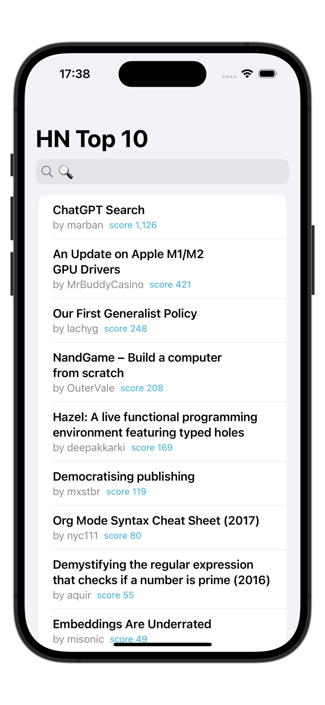
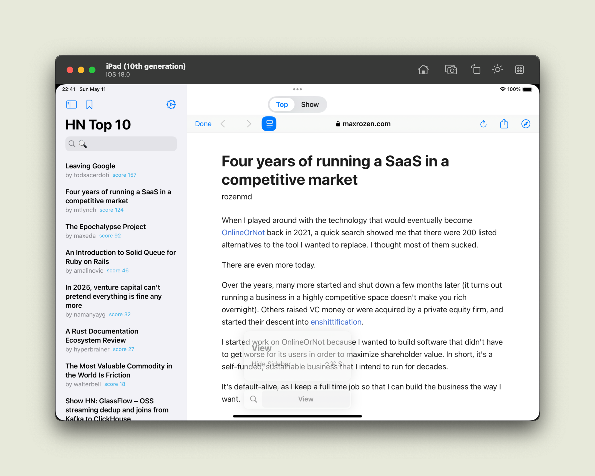

# HNSwift Client

A hacker news client by Chris.

Fully written in Swift UI.

you can now [install beta test](https://testflight.apple.com/join/6WBYaKWs).

## Feature

- [x] pull the latest top 10 HackerNews posts.
- [x] pull the latest top 10 HN show posts.
- [x] reader mode (backed by safari reader)
- [x] iPad split mode.
- [ ] random posts.

> Why we don't have "loadmore"? Because I don't want to doom scrolling and end up spending too much time in HackerNews (as I used to).

## Demo

Screenshot

<!-- 并排等高图片（Markdown 中可用） -->

    
    

## Documentation
For an architectural overview of the project, see [Arch.md](Arch.md).
